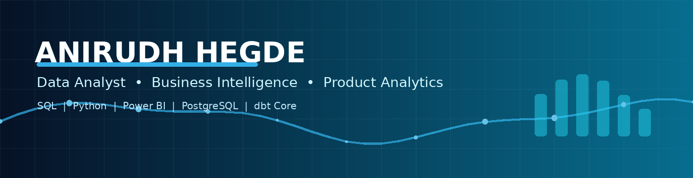
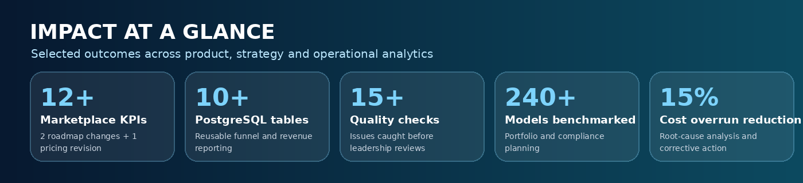
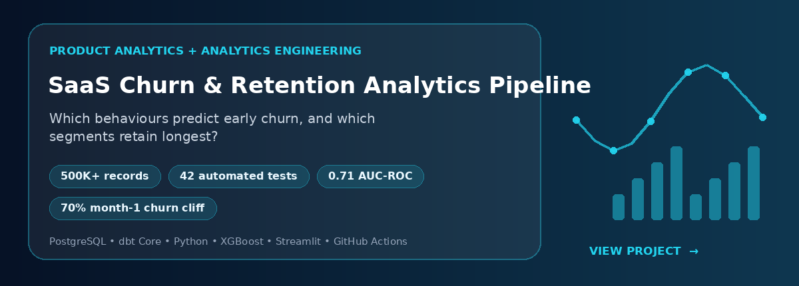
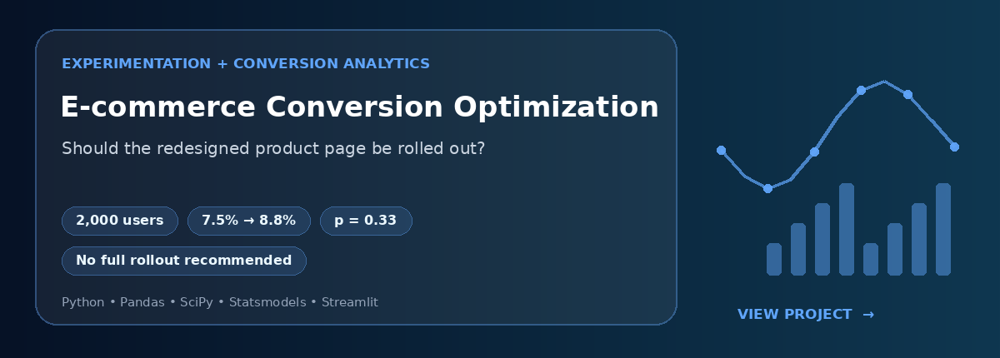
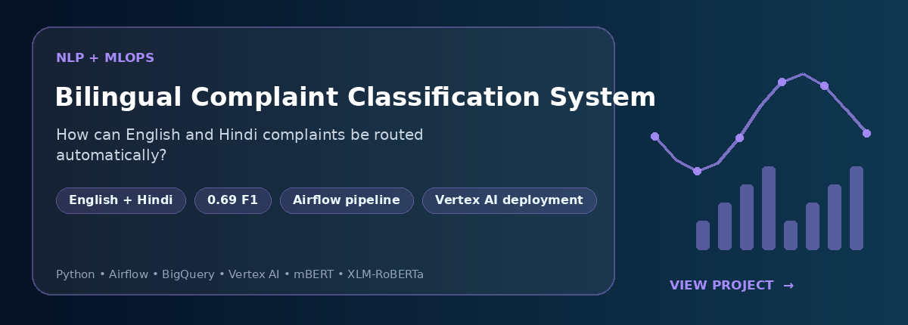

 

  

---

## 👋 About Me

I am a **Data Analyst with 3+ years of experience** across SaaS, automotive, and manufacturing. I use **SQL, Python, Power BI, PostgreSQL, and dbt Core** to turn business questions into reliable metrics, reproducible analysis, and practical recommendations.

My experience spans **KPI design, funnel analysis, forecasting, experimentation, data modelling, executive dashboards, and analytics engineering**.

> **Good analytics does not end with a dashboard. It changes a decision.**

- 🎓 **MS in Data Analytics Engineering**, Northeastern University, Boston — **3.92/4.0 GPA**
- 📍 Based in **Gurugram, India** and open to relocation across India
- ⚡ **Immediately available**
- 🎯 Targeting **Data Analyst, BI Analyst, Product Analyst, and Analytics Engineer** roles

 

---

## 📈 Impact at a Glance

  

---

## 🚀 Featured Projects

### 1. SaaS Churn & Retention Analytics Pipeline

**Decision supported:** Which behaviours predict early churn, and which user segments retain longest?

- Built an end-to-end analytics pipeline for **500K+ synthetic engagement records**
- Created layered raw, staging, and marts models with **42 automated tests**
- Applied Kaplan-Meier survival analysis and XGBoost, achieving **0.71 AUC-ROC**
- Identified a **70% month-1 churn cliff**, **8× longer retention for Power Users**, and engagement frequency as the strongest churn driver

---

### 2. E-commerce Conversion Optimization

**Decision supported:** Should a redesigned product page be rolled out?

- Analysed a **2,000-user A/B test** using Chi-square testing, Fisher's exact tests, confidence intervals, and funnel analysis
- Evaluated the complete **view → cart → purchase** journey
- Found no statistically significant lift from Treatment B: **7.5% → 8.8%, p=0.33**
- Recommended against full rollout and treated the Europe + Tablet result as exploratory

---

### 3. Automated Bilingual Complaint Classification System

**Decision supported:** How can English and Hindi complaints be routed automatically?

- Built an Airflow preprocessing pipeline with language filtering, schema validation, PII anonymisation, and abusive-content filtering
- Loaded processed data into BigQuery and fine-tuned mBERT and XLM-RoBERTa
- Achieved **0.69 F1** for product classification
- Added Vertex AI deployment, fairness checks, drift monitoring, and CI/CD automation

---

## 🧰 Analytics & Data Stack

  

  

 

| Capability | Tools and methods |
|---|---|
| **SQL & Data Modelling** | SQL, PostgreSQL, CTEs, window functions, dimensional modelling, schema design, data-quality testing |
| **BI & Reporting** | Power BI, DAX, Power Query, Tableau, Advanced Excel, KPI reporting, executive dashboards |
| **Product Analytics** | Funnel analysis, cohorts, retention, churn, A/B testing, hypothesis testing, conversion analysis |
| **Advanced Analytics** | Forecasting, survival analysis, root-cause analysis, statistical modelling, machine-learning evaluation |
| **Data Engineering** | dbt Core, Airflow, Docker, GitHub Actions, ETL/ELT, BigQuery, GCP, CI/CD |

---

## 💼 Experience Snapshot

### Ipserlab LLC, USA
**Data Analyst** · *Jul 2025 – Apr 2026*

- Standardized **12+ marketplace KPIs** across buyer conversion, vendor response time, and transaction volume
- Analysed the buyer journey from request creation through vendor matching, quotations, and transaction completion
- Designed reusable PostgreSQL reporting logic across **10+ tables**
- Implemented **15+ Python and SQL validation checks** for reporting reliability

### Maruti Suzuki India Limited, India
**Assistant Manager, Powertrain Planning (Analytics)** · *Jun 2022 – Jul 2023*

- Benchmarked **8 powertrain variants** against **240+ competitor models across 10+ OEMs**
- Modelled fleet fuel-efficiency, sales-mix, emissions, and compliance scenarios
- Developed forecasts through **2027** and an actual-vs-plan Power BI dashboard

### Godrej & Boyce Mfg. Co. Ltd., India
**Assistant Manager, Project Management (Analytics)** · *Jan 2021 – Jun 2022*

- Built a weekly Power BI project-health dashboard across **4 government contracts**
- Supported a **15% reduction in cost overruns** through root-cause analysis
- Analysed revenue concentration across **40+ client accounts**

---

## 🎓 Education

<table>
<tr>
<td width="50%" valign="top">

### Northeastern University
**MS in Data Analytics Engineering**  
Boston, Massachusetts · May 2025  
**GPA: 3.92/4.0**

</td>
<td width="50%" valign="top">

### Guru Gobind Singh Indraprastha University
**BTech in Mechanical and Automation Engineering**  
New Delhi, India · Sep 2020

</td>
</tr>
</table>

---

## 🤝 Let’s Connect

I am interested in roles where analytics can improve product, business, and operational decisions.

  

**Data Analyst · BI Analyst · Product Analyst · Analytics Engineer**

